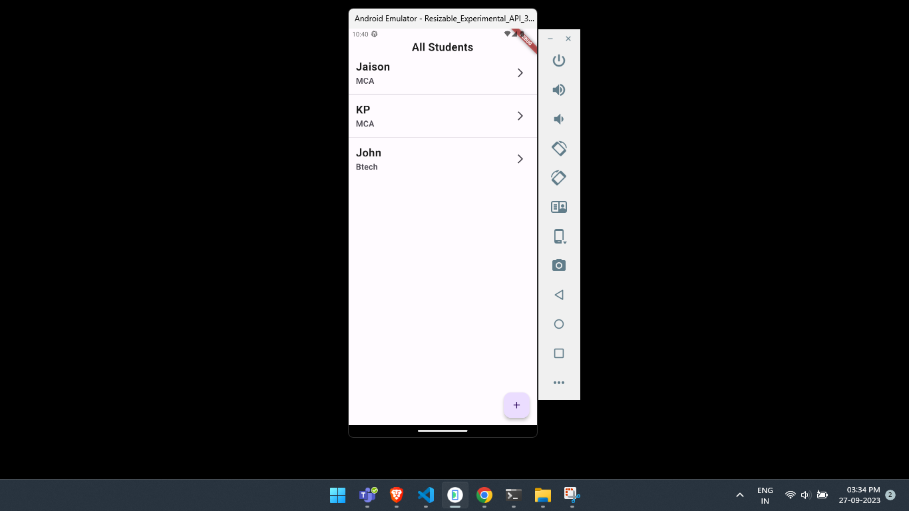
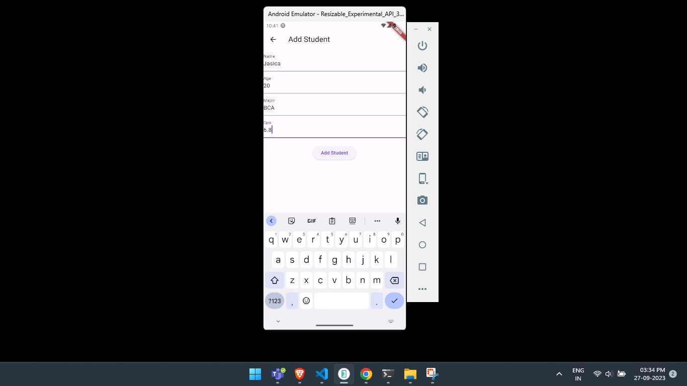
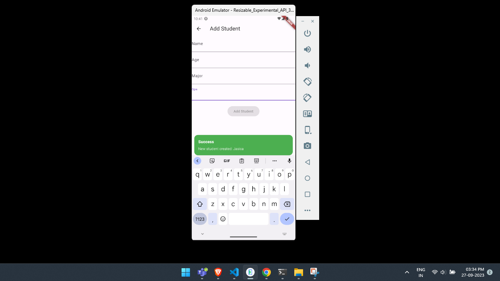

# student_dio_getx
Flutter API GET and POST using Dio with GetX

# Flutter GetX State Management Example

This Flutter project demonstrates how to use the GetX package for state management, perform API calls, and display data in a Flutter application.

## Overview

- The project uses the GetX package for state management, which allows us to efficiently manage and update the application's state.
- We perform API calls to retrieve a list of students and display them in a ListView.
- The project also includes a form to add new students to the list.
- Additionally, a circular loader is displayed while data is being fetched from the API.

## Features

1. **GetX for State Management:** We use GetX to manage the application's state. This includes controllers for managing students, text field data, and handling API calls.

2. **API Integration:** The project includes an example of making API calls using the Dio package to retrieve a list of students. The API response is then displayed in a ListView.

3. **Adding Students:** Users can add new students to the list using a form. The form validates input and sends data to the server.

4. **Circular Loader:** While fetching data from the API, a circular loader is displayed to indicate that data is being loaded.

5. **No Data Found Message:** If the API response is empty, a "No Data Found" message is displayed.

## Project Structure

- `lib/controllers/`: Contains the GetX controllers used for state management.
- `lib/views/`: Contains the UI views, including the main screen and the student form.
- `lib/main.dart`: The entry point of the Flutter app.

## Screenshots

1. View all students.
   
   
   
2. Add a student.

   

3. Showing snackbar on success.
   
   

4. After adding new student.

   
   
   
   
